  

### Hello! Welcome to my GitHub profile :)

- 📚 Academic education: System's Development Technician
- 📝 Studying: Technical Graduate in Internet Systems on UNICAP (4/5)
- 🔴 Main stack: Java | Spring Framework
- 🎲 hobbies: Pixel Artist, Instrumentalist and interested in Science Researches
- 📧 E-mail: carlosfcpinheiro82@gmail.com

## 📈 GitHub Status

     
    

## 💻 My tecnologies
  

  

   
  

          

## 📖 Learning

   

    

