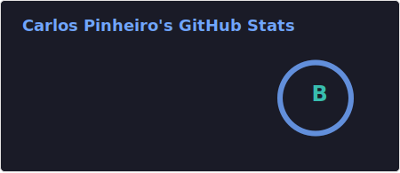
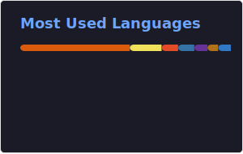

  

### Hello! Welcome to my GitHub profile :)

- 🚀 Role: **Full-Stack Developer**
- 📚 Academic education: Undergraduate Student in Internet Systems
- 🔴 Main stack: Java | Spring Framework
- 🔬 Interests: Scientific Research and Software Architecture.
- 🎲 Hobbies: pixel art and music
- 📧 Contact: [carlosfcpinheiro82@gmail.com](mailto:carlosfcpinheiro82@gmail.com)

## 📈 GitHub Status

     
    

## 💻 My tecnologies
  

  

   
  

          

## 📖 Learning

   

    

